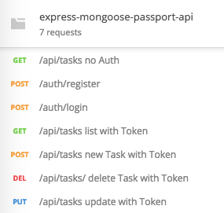
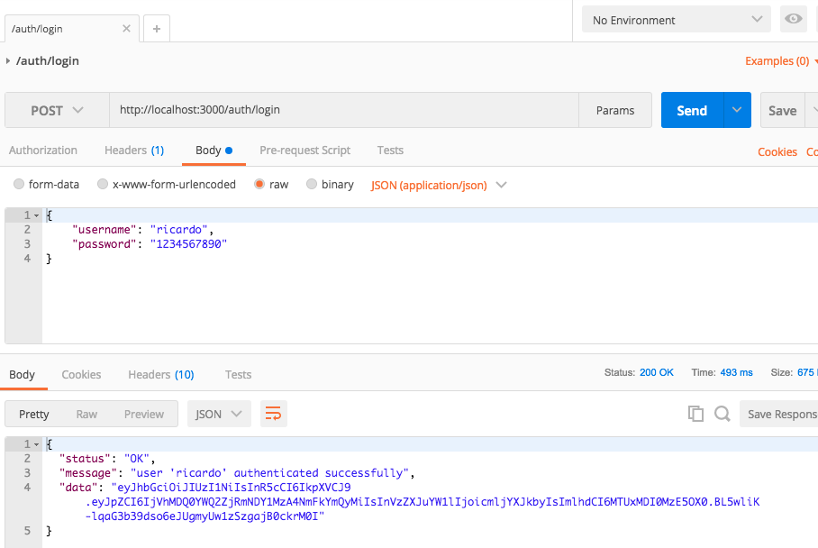
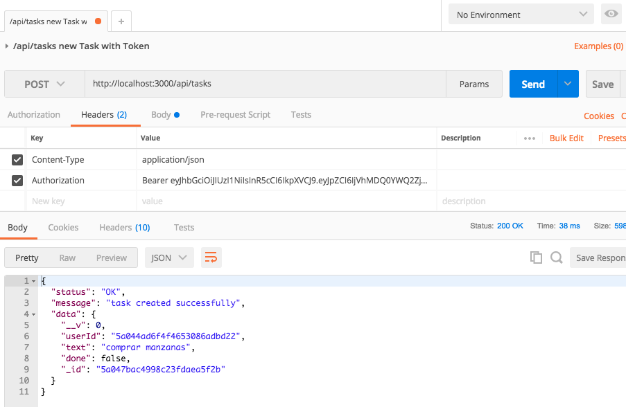

[](http://www.skylabcoders.com/)


### Express & Mongo API autenticadas con Passport.

Pequeña API de consultas a una base de datos MongoDB con autenticación de usuario.

### INSTALACION.

Para instalar este proyecto:

```bash
    $ git clone https://github.com/mtzfactory/express-mongoose-passport-api.git
    $ cd express-mongoose-passport-api
    $ npm install
    $ npm start
```

### POSTMAN

Para comprobar que el servidor funciona correctamente, puedes importar a *Postman* el archivo que se encuentra en la carpeta con el mismo nombre; este archivo tiene configurado las diferentes llamadas a la API.



Ejemplo de uso:

#1



#2



#### SkylabCoders Academy - Full Stack Web Development Bootcamp